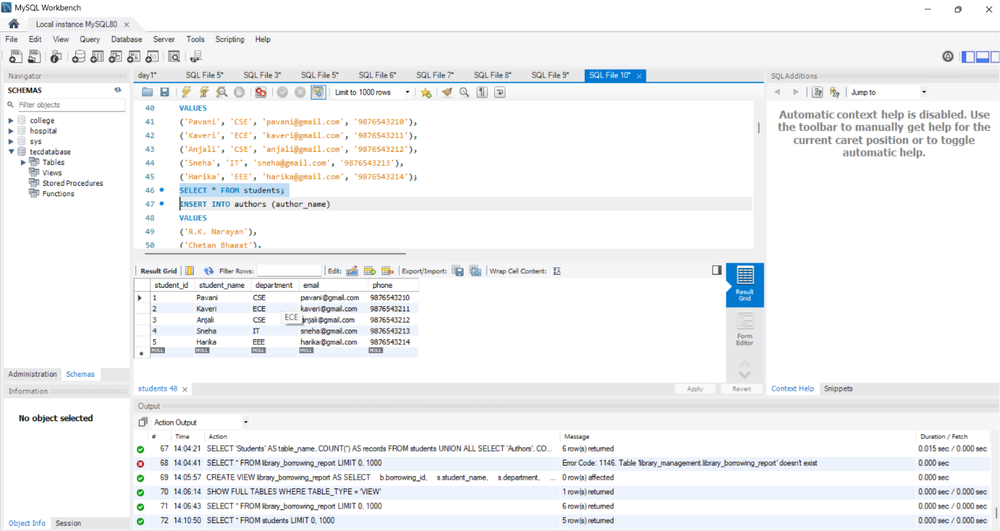
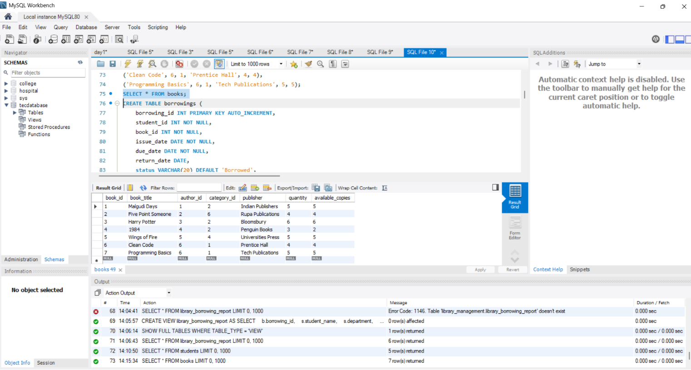
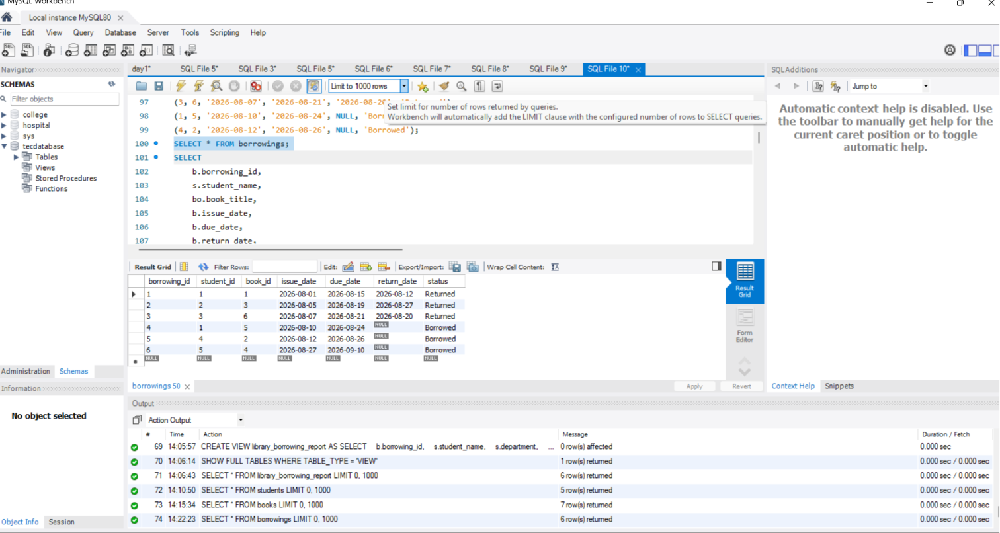
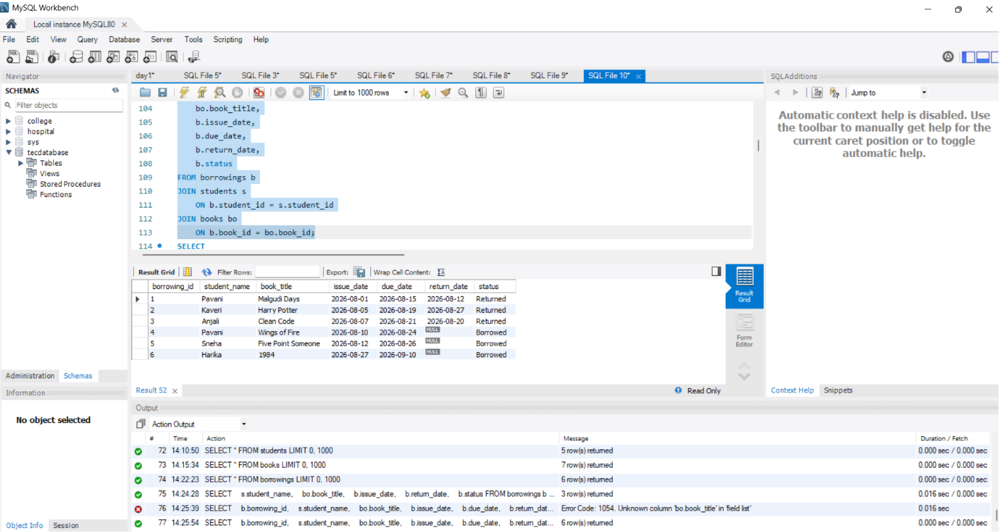
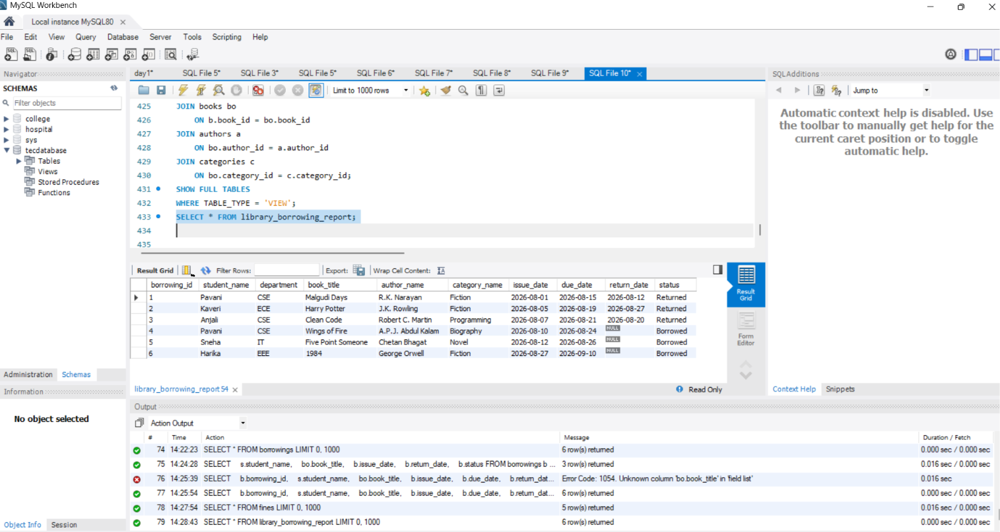

# 📚 Library Management System

## 📌 Project Overview

The **Library Management System** is a SQL-based database project developed using **MySQL**. It is designed to manage and organize library information such as students, books, authors, categories, borrowing records, and fines.

This project demonstrates relational database concepts including **Primary Keys, Foreign Keys, SQL JOINs, Aggregate Functions, Subqueries, Views, and Date Functions**.

---

## 🎯 Objectives

- To manage student information efficiently.
- To maintain book and author details.
- To organize books based on categories.
- To maintain book borrowing and returning records.
- To identify currently borrowed and overdue books.
- To calculate fines for late book returns.
- To generate useful library reports using SQL queries.

---

## ✨ Features

- 👩‍🎓 Student Management
- 📖 Book Management
- ✍️ Author Management
- 📚 Category Management
- 🔄 Book Borrowing and Returning
- 🔍 Book Search
- ⏰ Overdue Book Detection
- 💰 Fine Calculation
- 🔗 SQL JOIN Operations
- 📊 Aggregate Functions
- 🔎 Subqueries
- 👀 SQL Views
- 📋 Library Borrowing Reports

---

## 🛠️ Technologies Used

- **Database:** MySQL
- **Language:** SQL
- **Tool:** MySQL Workbench
- **Version Control:** Git & GitHub

---

## 🗄️ Database Tables

### 👩‍🎓 Students

Stores information about students registered in the library.

**Columns:**
- `student_id`
- `student_name`
- `department`
- `email`
- `phone`

### ✍️ Authors

Stores information about book authors.

**Columns:**
- `author_id`
- `author_name`

### 🗂️ Categories

Stores different categories of books.

**Columns:**
- `category_id`
- `category_name`

### 📚 Books

Stores information about books and their availability.

**Columns:**
- `book_id`
- `book_title`
- `author_id`
- `category_id`
- `publisher`
- `quantity`
- `available_copies`

### 🔄 Borrowings

Stores book issue and return information.

**Columns:**
- `borrowing_id`
- `student_id`
- `book_id`
- `issue_date`
- `due_date`
- `return_date`
- `status`

### 💰 Fines

Stores fine information related to borrowed books.

**Columns:**
- `fine_id`
- `borrowing_id`
- `fine_amount`
- `payment_status`

---

## 🔗 Database Relationships

```text
Students
    │
    │ student_id
    ▼
Borrowings
    │
    │ book_id
    ▼
Books
   ↙  ↘
Authors  Categories

Borrowings
    │
    │ borrowing_id
    ▼
Fines
```

---

## 📊 SQL Concepts Implemented

- `CREATE DATABASE`
- `CREATE TABLE`
- Primary Keys
- Foreign Keys
- `INSERT`
- `SELECT`
- `UPDATE`
- `WHERE`
- `LIKE`
- `JOIN`
- `LEFT JOIN`
- `COUNT()`
- `SUM()`
- `GROUP BY`
- `ORDER BY`
- `LIMIT`
- Subqueries
- `NOT IN`
- `DATEDIFF()`
- `COALESCE()`
- `CASE`
- SQL Views

---

## 🔍 Sample SQL Queries

### View All Books

```sql
SELECT * FROM books;
```

### Search for a Book

```sql
SELECT *
FROM books
WHERE book_title LIKE '%Code%';
```

### Display Borrowed Books

```sql
SELECT
    s.student_name,
    bo.book_title,
    b.issue_date,
    b.due_date,
    b.status
FROM borrowings b
JOIN students s
    ON b.student_id = s.student_id
JOIN books bo
    ON b.book_id = bo.book_id
WHERE b.status = 'Borrowed';
```

### Find Books That Were Never Borrowed

```sql
SELECT book_title
FROM books
WHERE book_id NOT IN
(
    SELECT book_id
    FROM borrowings
);
```

---

## 👀 Library Borrowing Report

A SQL View named `library_borrowing_report` is used to display complete borrowing information.

```sql
SELECT *
FROM library_borrowing_report;
```

The report combines:

- Student Name
- Department
- Book Title
- Author
- Category
- Issue Date
- Due Date
- Return Date
- Status

---

## 💰 Fine Calculation

The project calculates fines for overdue books using SQL date functions.

**Fine Rate: ₹5 per overdue day**

```text
Fine = Late Days × ₹5
```

The `DATEDIFF()` function is used to calculate the number of late days.

---

# 📸 Screenshots

The following screenshots show the database tables and SQL query results created using MySQL Workbench.

### 👩‍🎓 Students Table



---

### 📚 Books Table



---

### 🔄 Borrowings Table



---

### 🔗 JOIN Query Result



---

### 💰 Fine Calculation



---

## 🚀 How to Run the Project

### Step 1

Install **MySQL Server** and **MySQL Workbench**.

### Step 2

Open the SQL file:

```text
Library Database.sql
```

### Step 3

Execute the SQL script in MySQL Workbench.

### Step 4

Select the database:

```sql
USE library_management;
```

### Step 5

Check the tables:

```sql
SHOW TABLES;
```

### Step 6

View the library borrowing report:

```sql
SELECT * FROM library_borrowing_report;
```

---

## 📁 Project Structure

```text
Library_Management_Database/
│
├── Library Database.sql
├── README.md
│
└── Screenshots/
    ├── students.png
    ├── books.png
    ├── borrowings.png
    ├── joinsquery.png
    └── final.png
```

---

## 🌟 Advantages

- Reduces manual library record management.
- Provides organized student and book information.
- Makes borrowing and returning records easy to track.
- Helps identify overdue books.
- Provides fine calculation.
- Makes book searching easier.
- Maintains relationships between different entities.
- Generates useful library reports.

---

## 🔮 Future Scope

- Admin Login System
- Student Login System
- Web-Based User Interface
- Automatic Email Notifications
- Due Date Reminders
- Online Book Reservation
- Online Fine Payment
- Interactive Dashboard
- Advanced Library Analytics

---

## 🎓 Learning Outcomes

Through this project, I gained practical knowledge of:

- Relational Database Design
- MySQL
- SQL Queries
- Primary and Foreign Keys
- Table Relationships
- JOIN Operations
- Subqueries
- Aggregate Functions
- SQL Views
- Date Functions
- Database Management

---

## 👩‍💻 Author

**Pavani**

B.Tech Student

---

## 📄 License

This project is developed for **educational and academic purposes**.